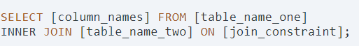

## Join

[Database](https://app.dataquest.io/m/179/joining-data-in-sql/1/introducing-joins)

#### Questions 
1. Alias
2. WHERE
3. subquery

  

---

WHERE
-------

> The important thing to remember is that the result of any subquery is 
>always calculated first, so we read from the inside out.
>- The subquery, in the red box, is calculated first. This simple query selects all columns from cities, filtering rows that are marked as capital cities by having a value for capital of 1.
>- The INNER JOIN joins the subquery result, aliased as c, to the facts table based on the ON clause.
>- Two columns are selected from the results of the join: - f.name, aliased as country - c.name, aliased as capital_city
### Inner join

The inner join clause is made up of two parts:

- **INNER JOIN**, which tells the SQL engine the name of the table you wish to join in your query, 
and that you wish to use an inner join. --**Creat a table**
- **ON**, which tells the SQL engine what columns to use to join the two tables.  

#### Left join

  
A left join includes all the rows that an inner join will select, 
plus any rows from the first (or left) table that don't have a match in the second table.  

  

**Order by/group by**  

----
#### Right join   
The main reason a right join would be used is when you are joining more than two tables. 
In these cases, using a right join is preferable because it can avoid restructuring your whole query to join one table. 
Outside of this, right joins are used reasonably rarely, 
so for simple joins it's better to use a left join than a right as it will be easier for your query to be read and understood by others.

#### Subquery
