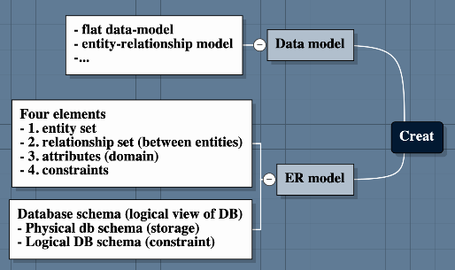
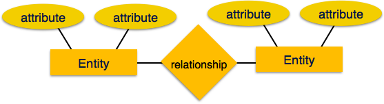
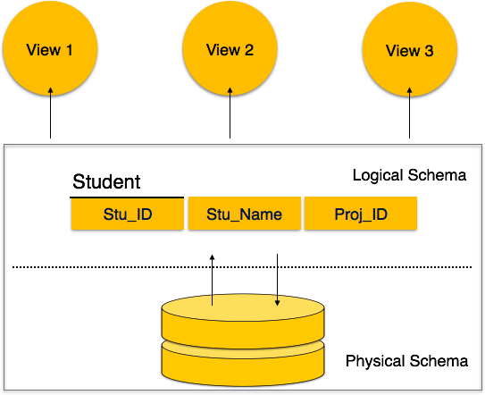
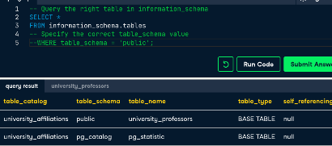

## Get to know the database
[Reference](https://www.tutorialspoint.com/dbms/dbms_data_schemas.htm)  

### 1.ER model
Entity-Relationship (ER) Model is based on the notion of real-world entities and relationships among them.
ER Model is based on −

- Entities and their attributes.
- Relationships among entities.   

#### Entity − 
An entity in an ER Model is a real-world entity having properties called attributes. 
Every attribute is defined by its set of values called **domain**. 

For example, in a school database, a student is considered as an entity. 
Student has various attributes like name, age, class, etc.

#### Relationship − 
The logical association among entities is called relationship. 
Relationships are mapped with entities in various ways. 
Mapping cardinalities define the number of association between two entities.

**Mapping cardinalities** −

- one to one
- one to many
- many to one
- many to many

#### 1.1 Data schema
A database schema is the skeleton structure that represents the **logical view** of the entire database.   
It defines 
- how the data is organized and 
- how the relations among them are associated. 
A database schema defines its entities and the relationship among them.  
It formulates all the **constraints** that are to be applied on the data.  

A database schema can be divided broadly into two categories −

**Physical Database Schema −**   
This schema pertains to the actual storage of data and its _form of storage_ like files, 
indices, etc. 
It defines how the data will be stored in a secondary storage.

**Logical Database Schema −**   
This schema defines all the _logical constraints_ that need to be applied on the data stored. 
It defines tables, views, and integrity constraints.

### 2. Information_schema 
is a **meta-database** that holds information about your current database. 
information_schema has **multiple tables** you can query with the known SELECT * FROM syntax.

- tables: information about all tables in your current database
- columns: information about all columns in all of the tables in your current database
....
#### 2.1 information_schema.tables
table_schema:  
table_name:  

